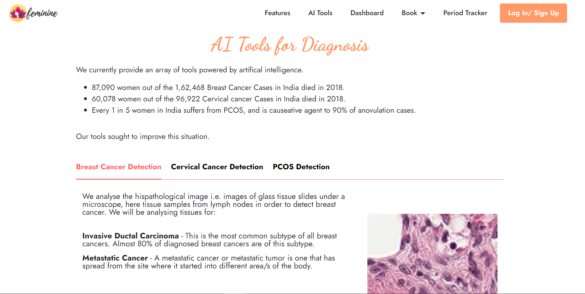
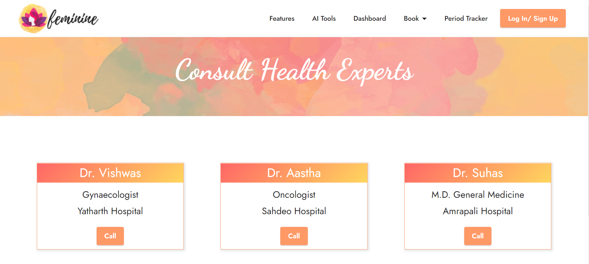
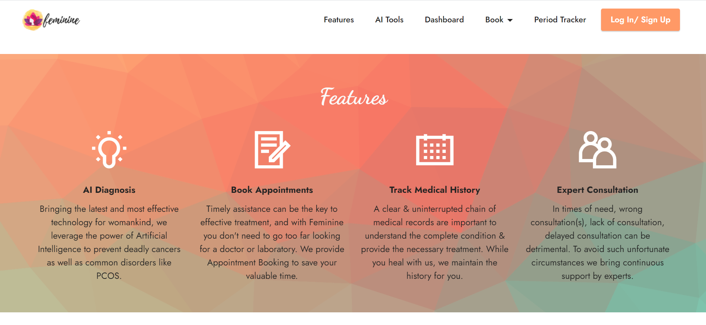
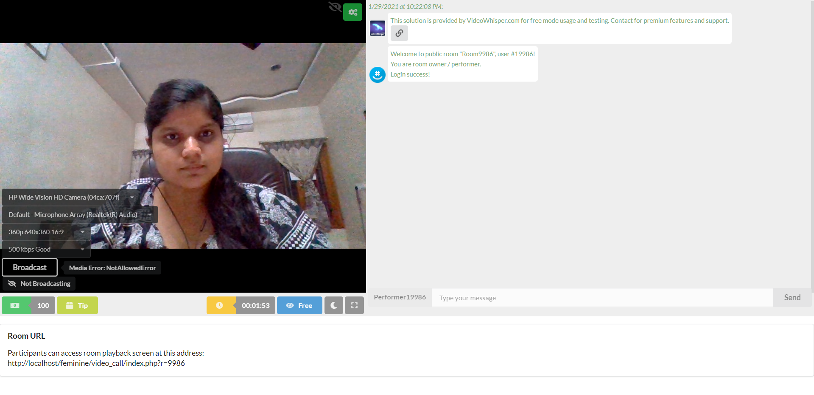

# Feminine | Submission of Team HackDivas
<b>Members:
Anjali Patle, Sakshi Bhandarkar and Priyanshi Sharma</b>

<p align="center">
    
  </a>

Feminine is an initiative through which we want to build an all-in-one women health platform, which diagnoses women specific health issues and help raise awareness for its treatment and management. With a lot of fear of the stigma associated with reproductive health services, women often avoid making use of such services. This stigma imposes a great deal of mental stress, fear, and depression on patients and causes delays in the diagnosis and treatment of their conditions. Through Feminine, we aim at solving this barrier for women to connect with doctor and try to reduce the errors and hassle in the diagnosis of the ailments.

## Features
* <b>Breast Cancer Detection tool :</b> Detects the presence of Metastatic Tissue and Invasive Ductal Carcinoma using two AI Models
* <b>Predict Cervical Cancer</b> and preliminary test results according to user’s demographic information, habits, and historic medical records
* <b>Predict PCOS</b> using AI in a person on the basis of their lifestyle and history.
* Dedicated Dashboard for Patient and Doctor
* Tracking of previous Prescription & Medical History 
* Menstrual Cycle Tracker
* Booking Lab/Appointment
* Video Conferencing for expert consultancy

## Technology Stack

### Artificial Intelligence & Web Technology

- Machine Learning
  - Python - Sklearn, Keras, Tensorflow etc. for the ML Model(s)
  - Django REST Framework (for Model Endpoints)


- Frontend
  - HTML
  - CSS
  - Bootstrap
  
- Backend
  - PHP 
  - MySQL (Database)

- Tools
  - Microsoft Azure Machine Learning Studio for the ML Model(s)
  - Xampp
  - Git
  - Github

### Sample User Credentials
- For Doctor
  - Username - doctor
  - Password - doctor

- For Patient
  - Username - patient
  - Password - patient

## Instructions to Install and Setup:

- Download and Install Xampp using link  :- https://www.apachefriends.org/download.html
- Download the Zip or clone the repository using command : -
``` bash
git clone https://github.com/priyanshisharma/Feminine.git
```
- Go to the directory where Xampp is installed. For eg. C:\xampp\htdocs
- Copy the project folder and paste it in the address mentioned above.
- Open PhpMyAdmin, create a database named 'feminine' and import the feminine.sql file from the db folder present in the repo.
- Launch any browser window and search localhost/Feminine.

## Machine Learning Tools

### Breast Cancer Prediction Tool

In order to detect cancer, a pathologist examines the slide of tissue under a microscope. S/he visually ensures that there's no cancer and ultimately find malignant areas. We currently provide a tool powered by artifical intelligence which analyses hispathological image i.e. images of glass tissue slides under a microscope, here tissue samples from lymph nodes in order to detect breast cancer. We will be analysing tissues for:

* **Invasive Ductal Carcinoma** - This is the most common subtype of all breast cancers. Almost 80% of diagnosed breast cancers are of this subtype.
* **Metastatic Cancer** - A metastatic cancer or metastatic tumor is one that has spread from the site where it started into different area/s of the body.

We  use the 'Breast Histopathology Images' dataset available at https://www.kaggle.com/c/histopathologic-cancer-detection.

* **IDC_model** 
    * Accuracy: 0.88
    * F1 Score: 0.88

* **Metastatic_model** 
    * Accuracy: 0.94
    * F1 Score: 0.94
    
## Cervical Cancer Risk Classification Tool
Cervical cancer is a type of cancer that occurs in the cells of the cervix — the lower part of the uterus that connects to the vagina. It isn't clear what causes cervical cancer, but it's certain that HPV plays a role. HPV is very common, and most people with the virus never develop cancer. This means other factors — such as your environment or your lifestyle choices — also determine whether you'll develop cervical cancer.

On the basis of these factors that you may answer about in our form below, we inform you whether you are at risk of cervical cancer or not. We facilitate this by providing predictions for four cervical cancer tests, which may be quite expensive otherwise.

We're using the [UCI's Machine Learning repository's Cervical cancer (Risk Factors) Data Set](https://archive.ics.uci.edu/ml/datasets/Cervical+cancer+%28Risk+Factors%29). The dataset was collected at 'Hospital Universitario de Caracas' in Caracas, Venezuela. The dataset comprises demographic information, habits, and historic medical records.

* **Hinselmann test** - This examines the tissues by illuminating and magnifying is using a colposcope. Our model uses the following attributes

|Category|Value|
|-|-|
|Model|SparseNormalizer, Extreme Random Trees|
|Average Precision Score Weighted|0.94|
|Accuracy|0.93|

* **Schiller test** - Schiller's test or Schiller's Iodine test is a medical test in which iodine solution is applied to the cervix in order to diagnose cervical cancer. Our model uses the following attributes

|Category|Value|
|-|-|
|Model|VotingEnsemble|
|Ensembled Algorithms|'ExtremeRandomTrees', 'KNN', 'RandomForest', 'KNN', 'ExtremeRandomTrees', 'KNN', 'ExtremeRandomTrees'|
|Ensembled Weights|0.1, 0.1, 0.1, 0.2, 0.1, 0.3, 0.1|
|Ensembled Iterations|6, 23, 18, 24, 25, 7, 13|
|Average Precision Score Weighted|0.92|
|Accuracy|0.93|

* **Cytology test** - This is the examination of suspected cells from the body under a microscope. Our model uses the following attributes

|Category|Value|
|-|-|
|Model|VotingEnsemble|
|Ensembled Algorithms|'KNN', 'KNN', 'KNN', 'KNN', 'KNN', 'LightGBM', 'SVM', 'XGBoostClassifier'|
|Ensembled Weights|0.21428571428571427, 0.07142857142857142, 0.14285714285714285, 0.07142857142857142, 0.07142857142857142, 0.21428571428571427, 0.14285714285714285, 0.07142857142857142|
|Ensembled Iterations|66, 61, 68, 59, 73, 41, 27, 50|
|Average Precision Score Weighted|0.92|


* **Biopsy** - This is the final test. The process involves extraction of sample cells or tissues for examination to determine the presence or extent of a disease.Our model uses the following attributes

|Category|Value|
|-|-|
|Model|VotingEnsemble|
|Ensembled Algorithms|'LightGBM', 'RandomForest', 'XGBoostClassifier', 'ExtremeRandomTrees', 'XGBoostClassifier'|
|Ensembled Weights|0.3333333333333333, 0.16666666666666666, 0.16666666666666666, 0.16666666666666666, 0.16666666666666666|
|Ensembled Iterations|0, 14, 15, 6, 26|
|Average Precision Score Weighted|0.90|

### Polycystic Ovarian Syndrome (PCOS) Risk Assessment

PCOS or Polycystic Ovarian Syndrome is a hormonal disorder causing enlarged ovaries with small cysts on the outer edges. The cause of polycystic ovary syndrome isn't well understood, but may involve a combination of genetic and environmental factors.

The dataset for PCOS is a real-time data set that taken from a survey conducted among 119 women between the ages of 18 and 22. The dataset is primarily based on their lifestyle and food intake habits. The symptoms i.e. attributes are classified based on classification algorithms to predict whether the patient may have PCOS or not available [here](https://github.com/PCOSSurvey/PCOSData).

The model we've made has the following attributes:

|Category|Value|
|-|-|
|Model|VotingEnsemble|
|Ensembled Algorithms|'GradientBoosting', 'LightGBM', 'XGBoostClassifier', 'GradientBoosting', 'ExtremeRandomTrees', 'LogisticRegression'|
|Ensembled Weights|0.16666666666666666, 0.16666666666666666, 0.16666666666666666, 0.16666666666666666, 0.16666666666666666, 0.16666666666666666|
|Ensembled Iterations|17, 0, 1, 24, 6, 25|
|Average Precision Score Weighted|0.98|
|Accuracy|0.96|


## References and Citations

* https://www.researchgate.net/publication/263052166_Automatic_detection_of_invasive_ductal_carcinoma_in_whole_slide_images_with_Convolutional_Neural_Networks
* https://academic.oup.com/gigascience/article/7/6/giy065/5026175
* Kelwin Fernandes, Jaime S. Cardoso, and Jessica Fernandes. 'Transfer Learning with Partial Observability Applied to Cervical Cancer Screening.' Iberian Conference on Pattern Recognition and Image Analysis. Springer International Publishing, 2017.
* Andrew Janowczyk and Anant Madabhushi ‘Deep learning for digital pathology image analysis: A comprehensive tutorial with selected use cases’ National Library of Medicine, 2016 Jul 26
* Angel Cruz-Roa, Ajay Basavanhally, Fabio González, Hannah Gilmore, Michael Feldman; Shridar Ganesan, Natalie Shih, John Tomaszewski and Anant Madabhushi. ‘Automatic detection of invasive ductal carcinoma in whole slide images with convolutional neural networks’ SPIE Proceedings Vol. 9041: Medical Imaging 2014: Digital Pathology
* Hannah Gilmore, Fabio A. González, Ajay Basavanhally, Angel Cruz-Roa, ‘Automatic detection of invasive ductal carcinoma in whole slide images with Convolutional Neural Networks’ February 2014 Proceedings of SPIE - The International Society for Optical Engineering 9041
* Vikas B. , B. S. Anuhya, Manaswini Chilla and Sipra Sarangi, 'A Critical Study of Polycystic Ovarian Syndrome (PCOS) Classification Techniques’ IJCEM International Journal of Computational Engineering & Management, Vol. 21 Issue 4, July 2018
* PCOS-Survey/PCOSData. (2017). GitHub. Retrieved 30 November 2017, from https://github.com/PCOSSurvey/PCOSData


## Screenshots









## Team HackDivas

* Priyanshi Sharma
* Anjali Patle
* Sakshi Bhandarkar

### More power to women!
